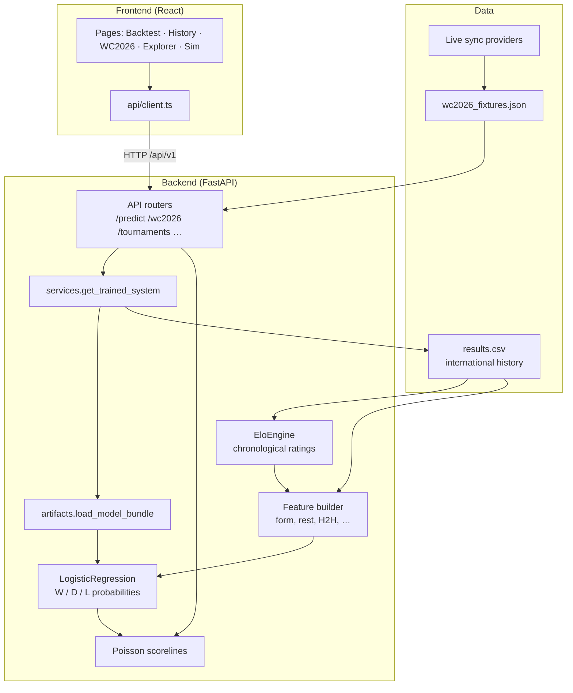

# World Cup 2026 Oracle

Predict international football match outcomes (W/D/L) with an Elo + logistic model, walk-forward backtesting, and an interactive React UI for historical World Cups, WC 2026 fixtures, scenarios, and Monte Carlo simulation.

**Repository:** [github.com/Breakeggs3000/world-cup-2026-oracle](https://github.com/Breakeggs3000/world-cup-2026-oracle)

## Project structure

```
world-cup-2026-oracle/
├── src/
│   ├── backend/                    # FastAPI prediction API (Python 3.12)
│   │   ├── app/
│   │   │   ├── main.py             # App entry, CORS, lifespan, health
│   │   │   ├── services.py         # Cached model loader + backtest helpers
│   │   │   ├── api/                # REST route handlers
│   │   │   │   ├── routes.py       # Composes all /api/v1 routers
│   │   │   │   ├── predictions.py  # Single-match + scenario predict
│   │   │   │   ├── wc2026.py       # 2026 fixtures + standings
│   │   │   │   ├── matches.py      # Historical World Cup matches
│   │   │   │   ├── simulation.py   # Monte Carlo tournament sim
│   │   │   │   ├── backtest.py     # Walk-forward metrics API
│   │   │   │   ├── models.py       # Model registry
│   │   │   │   └── sync.py         # Live fixture sync status
│   │   │   ├── model/              # Prediction engine
│   │   │   │   ├── elo.py          # Chronological Elo ratings
│   │   │   │   ├── predictor.py    # Features + logistic regression
│   │   │   │   ├── backtest.py     # Train/val/test splits + metrics
│   │   │   │   ├── artifacts.py    # Save/load trained model bundles
│   │   │   │   └── simulation.py   # WC 2026 group-stage Monte Carlo
│   │   │   ├── data/               # Data loading + static fixtures
│   │   │   │   ├── loader.py       # results.csv, WC filters, team aliases
│   │   │   │   ├── store.py        # Fixture persistence
│   │   │   │   ├── wc2026_fixtures.json
│   │   │   │   └── providers/      # Live score sync (API, HTML, seed)
│   │   │   └── sync/               # Background fixture sync scheduler
│   │   ├── scripts/                # fetch_data, train_model, run_backtest
│   │   └── tests/                  # pytest (API, model, no-leakage)
│   └── frontend/                   # React + Vite UI (Node 22)
│       └── src/
│           ├── api/client.ts       # Typed fetch wrapper → /api/v1
│           ├── pages/              # One page per sidebar tab
│           │   ├── BacktestDashboard.tsx
│           │   ├── HistoricalWorldCup.tsx
│           │   ├── WorldCup2026.tsx
│           │   ├── MatchExplorer.tsx
│           │   └── TournamentSim.tsx
│           └── components/         # MatchCard, ProbabilityBar, charts, …
├── workspace/artifacts/            # Generated outputs (not all committed)
│   ├── models/                     # Trained model registry + joblib files
│   └── backtest_report.json        # Validation/test metrics
├── docs/                           # USAGE.md, DEPLOY.md
└── tools/scripts/                  # start-dev.ps1, deploy helpers
```

| Layer | Role |
|-------|------|
| **Frontend** | React SPA — tabs call the API and render probabilities, scorelines, backtest charts |
| **API** | FastAPI routers validate requests and delegate to services |
| **Services** | Load the active model once (cached), expose history + predictions |
| **Model** | Elo engine → 10 features → logistic regression → W/D/L + Poisson scorelines |
| **Data** | Historical results CSV + curated WC 2026 fixtures + optional live sync |
| **Artifacts** | Versioned trained models and backtest reports under `workspace/` |

## How it works (high level)



**Prediction path** (every upcoming or ad-hoc match):

1. **Load history** — `load_results()` reads international match results from cache.
2. **Elo snapshot** — replay all matches before the fixture date to get current team ratings.
3. **Build features** — 10 inputs (Elo delta, form, rest days, knockout flag, H2H, …) using only past data.
4. **Classify** — standardized features → trained logistic regression → `P(W)`, `P(D)`, `P(L)`.
5. **Scorelines** — derive likely scores from outcome probs via independent Poisson rates.
6. **Respond** — JSON with probabilities, predicted outcome, top scorelines; UI renders bars and cards.

**Training path** (offline, `scripts/train_model.py`):

1. Walk-forward over all historical matches (no future leakage).
2. Fit logistic regression on data through 2017; validate 2018–2022; test after 2022.
3. Persist predictor, Elo snapshot, metrics, and registry entry to `workspace/artifacts/models/`.

**At runtime**, the backend loads the active model from the registry (or trains on first request if artifacts are missing). WC 2026 fixtures are enriched per request; Monte Carlo simulation samples outcomes from those probabilities across group-stage matches.

## Prerequisites

Install these **once per machine** (global tooling only — project deps stay local):

| Tool | Purpose | Windows install |
|------|---------|-----------------|
| [uv](https://docs.astral.sh/uv/) | Python versions + venvs | `powershell -ExecutionPolicy ByPass -c "irm https://astral.sh/uv/install.ps1 \| iex"` |
| [fnm](https://github.com/Schniz/fnm) | Node.js versions | `winget install Schniz.fnm` |

**Permanent PATH (Windows):** The uv installer adds `C:\Users\<you>\.local\bin` to your user PATH. Restart the terminal (or IDE) after install. fnm is added by winget; open a new shell so PATH updates apply.

**fnm shell hook (PowerShell):** Add to your profile (`notepad $PROFILE`) so `fnm use` and `.node-version` work in every session:

```powershell
fnm env --use-on-cd --shell powershell | Out-String | Invoke-Expression
```

## Setup

Each project uses its own **`.venv`** (Python) and **`.node-version`** (Node). Do not share virtual environments between repos.

### 1. Backend (`src/backend`)

Pinned Python: **3.12** (see `.python-version`).

```powershell
cd src/backend
uv python install 3.12
uv venv .venv --python 3.12
uv pip install -r requirements.txt
# Or, with uv project mode: uv sync

uv run python scripts/fetch_data.py
uv run python scripts/run_backtest.py
uv run python scripts/train_model.py   # persist model to workspace/artifacts/models/
uv run pytest tests/ -v
```

Virtualenv path: `src/backend/.venv` (gitignored).

### 2. Frontend (`src/frontend`)

Pinned Node: **22** LTS (see `.node-version`).

```powershell
cd src/frontend
fnm install
fnm use
npm install
npm run build
```

Node is installed under fnm’s data directory (e.g. `%APPDATA%\fnm\node-versions\`).

## Run locally

**Quick start** (two windows, handles uv/fnm PATH):

```powershell
.\tools\scripts\start-dev.ps1
```

**Backend** (from `src/backend`):

```bash
uvicorn app.main:app --reload --port 8000
```

**Frontend** (from `src/frontend`):

```bash
npm run dev
```

Open http://localhost:5173 — Vite proxies `/api` to the backend.

**First startup:** The backend pre-builds the prediction model on launch (~2–3 minutes). Wait for `Model ready.` in the backend terminal before match lists populate. See **[docs/USAGE.md](./docs/USAGE.md)** for a full run guide and tab-by-tab walkthrough.

## API highlights

**Current API version: 1.0.0** — prefer `/api/v1/...` (legacy `/api/...` still works).

| Endpoint | Description |
|----------|-------------|
| `GET /api/v1/version` | API + active model semver |
| `GET /api/v1/health` | Health, `api_version`, `active_model_version` |
| `GET /api/v1/backtest/summary` | Overall and per-WC metrics |
| `GET /api/v1/tournaments/{year}/matches` | Historical WC matches with predictions |
| `GET /api/v1/wc2026/fixtures?status=all\|upcoming\|played` | 2026 fixtures + probabilities |
| `GET /api/v1/predict?home=&away=` | Single match prediction |
| `POST /api/v1/predict/scenario` | Scenario sliders |
| `POST /api/v1/simulate/wc2026` | Monte Carlo tournament sim |
| `GET /api/v1/models` | Model registry (ids + semver versions) |

## Data sources

- [martj42/international_results](https://github.com/martj42/international_results) — downloaded to `src/backend/app/data/cache/results.csv` (gitignored)
- `src/backend/app/data/wc2026_fixtures.json` — curated 2026 schedule (update manually as results arrive)
- `src/backend/app/data/team_aliases.json` — name normalization

## Artifacts

| Path | Contents |
|------|----------|
| `workspace/artifacts/backtest_report.json` | Walk-forward metrics (regenerated by `run_backtest.py`) |
| `workspace/artifacts/models/` | Versioned trained models — see [models/README.md](./workspace/artifacts/models/README.md) |

Train and register the baseline model:

```powershell
cd src/backend
uv run python scripts/train_model.py
```

List models: `GET /api/models` · Select at runtime: `$env:WC_MODEL_ID = "elo-logistic-v1"`

## Documentation

| Doc | Contents |
|-----|----------|
| [docs/USAGE.md](./docs/USAGE.md) | Setup checklist, how to run, what each tab shows, troubleshooting |
| [docs/DEPLOY.md](./docs/DEPLOY.md) | **Deploy to Vercel + Render** — step-by-step for the live site |
| [AGENTS.md](./AGENTS.md) | Agent workspace conventions |

## Deployment

**Full guide:** [docs/DEPLOY.md](./docs/DEPLOY.md)

**Quick summary:** Push to GitHub → backend on [Render](https://render.com) via `render.yaml` → frontend on [Vercel](https://vercel.com) via `vercel.json`. Set `VITE_API_URL` (frontend) and `ALLOWED_ORIGINS` (backend) to each other's URLs.

```powershell
git remote add origin https://github.com/Breakeggs3000/world-cup-2026-oracle.git
git push -u origin master
```

Then connect the repo in Render (Blueprint) and Vercel (import project). See [docs/DEPLOY.md](./docs/DEPLOY.md) for env vars, custom domains, and troubleshooting.
